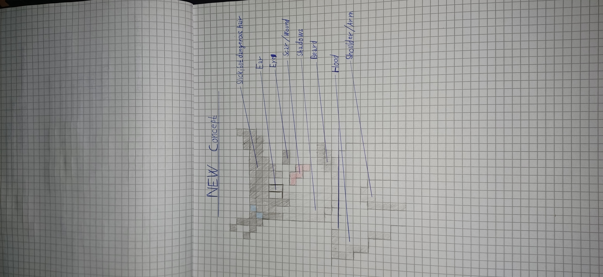
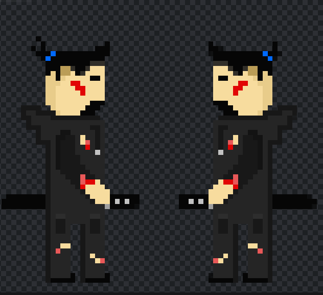
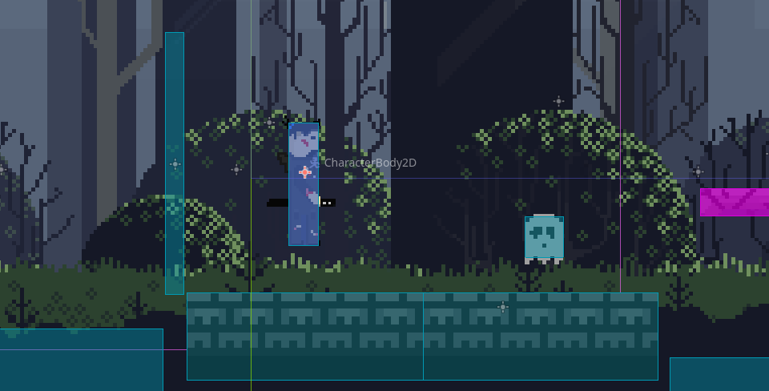
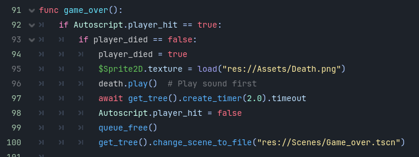
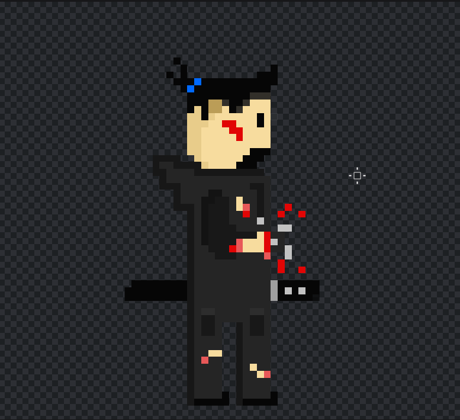
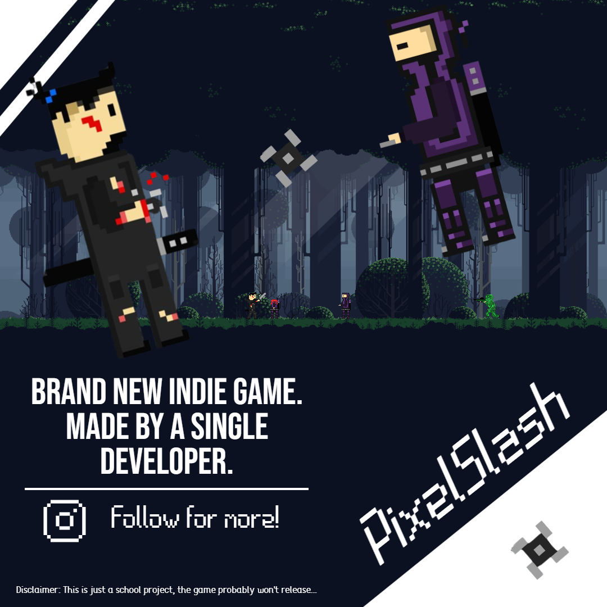
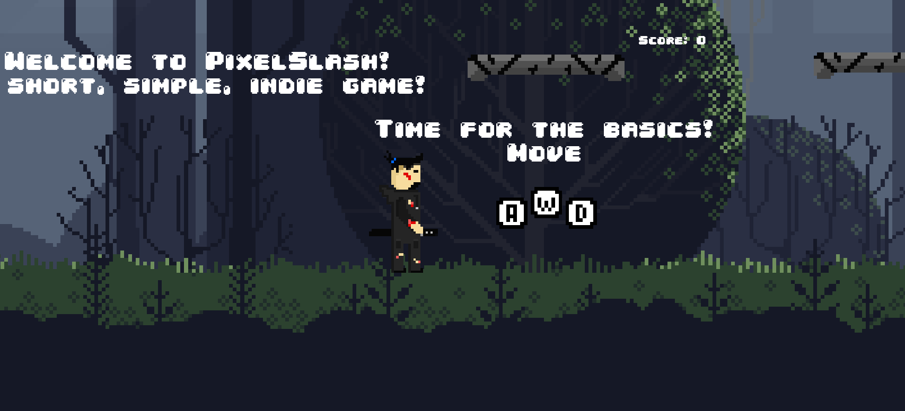

# Projekt

## Základní koncepce
- Jedná se o 2D Platformovku s prvky boje. 
- Ve hře lze "kosit" nepřátele, sbírat sběratelské předměty, atd.
- Hra je tvořena v enginu Godot.
- Pointou hry je se probojovat skrze nepřátele, až ke konci.

## Game Design
- Všechny postavy mají pouze jeden život, to znamená, že stačí pouze jedna rána, a hra může skončit...
- Ve hře je funkční score-systém
- Skóre lze navýšit zabitím nepřítele či když hráč sebere některý ze sběratelských předmětů.
- Zabití je za 100 bodů, SP je za 50 bodů
- Hráč má dva typy útoku, pro extra zábavu.
- Příběh zatím do hry není zakomponovaný
- Ve hře se zatím nachází pouze jedna úroveň, vytvořit novou by však moc času nezabralo. :D

## Grafika
Některé grafické assety byli staženy, jako open-source, z internetu, jako například pozadí úrovně.
Ostatní assety byli tvořeny např.:
- V Pixlr
- V Malování
- A jiné
Některé části byli však i navrženy jako skici na papíru.

## Zvuky
Co se týče zvuků, ty byli plně staženy z internetu, někdy i s trochou úpravy...
Většina nalezena na webu: [Pixabay](https://pixabay.com/cs/)
Některé zvuky byli případně upraveny na webu: [MP3 Cutter](https://mp3cut.net)

## Hudba
Ve hře se hudba příliš nějak nevyskytuje.
V pozadí je pouze ambient, pro větší atmosféru.
Ambient byl vytvořen uživatelem - JDSherbert

## Implementace
Pár ukázek ze samotné implementace / práce na projektu

## Propagace
Za účelem propagace, jsem se rozhodl zvolit sociální síť Instagram.
Zde jsem hře vytvořil celý profil, tak aby lidé měli alespoň nějakou představu, jak se na hře pracuje...
[Instagram - PixelSlash](https://www.instagram.com/pixelslash5/)

## Finální verze
Hra je stále v dosti nestabilním / nefunkčním stavu. Nepřátele se například nesoustředí na hráče, tudíž na něj ani přímo neútočí.
Hra má však již funkční útoky jak hráče, tak i nepřátel, i přesto že se na hráče nesoustředí, stále útočí...
Hra má jednu úroveň s krátkým úvodem a několika nepřáteli.
Hra má funkční hlavní menu, menu po smrti hráče a také vítězné menu.
Ve hře lze nalézt také sběratelské předměty, pro extra skóre.

## Závěr
Celkově jsem s projektem tak nějak spokojený. Hra sice není v nejlepším stavu, ale ani v nejhorším.
Práce na hře mě vskutku bavila, možná na ní budu pracovat i nadále...
Hra má stále mnoho chyb, i tak je však již jakž takž hratelná. :D
Co se týče různých úskalí řekl bych, že největším problémem je samotný útok nepřátel.
Snažil jsem se jej řešit za pomocí technologie "RayCasting."
To však moc nefungovalo, a tak jsem nakonec přešel k technologiím jako např.: "Area2D" či "VisibleOnScreenEnabler2D"
Útoky však stále mají mnoho chyb... 
Nepřátelé občas koukají opačným směrem, než kterým útočí, či neutočí přímo na hráče.
Celkově bych však řekl že byl projekt především úspěšný.
Většina hlavních částí byla úspěšně splněna, a případné úpravy a změny by dle mého názoru nezabrali příliš mnoho času...

### Video ze hry

### Audio - credit
- Skok - VoiceBosch
- Zabití - RichardDooDee23 (Pixabay)
- Hudba / ambient v pozadí - JDSherbert
- Meč - Cyberwave Orchestra

### Grafika - credit
Pozadí - Eder Muniz
